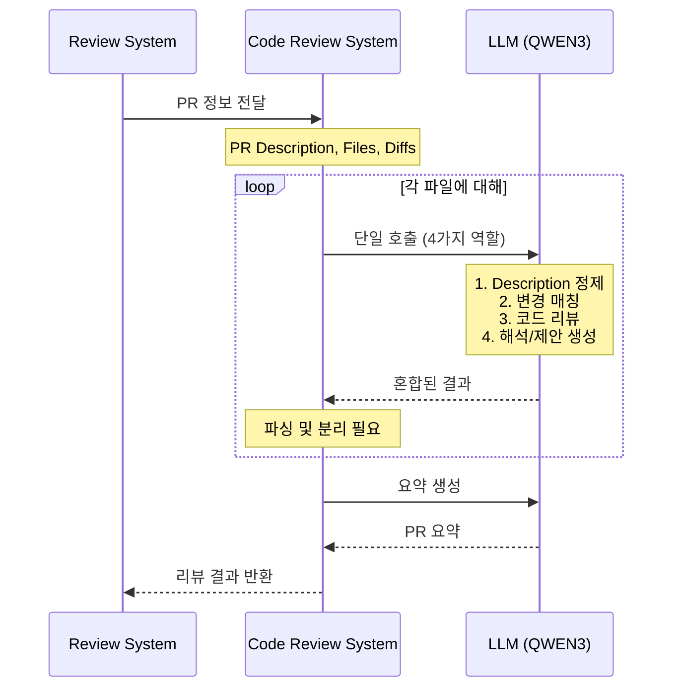
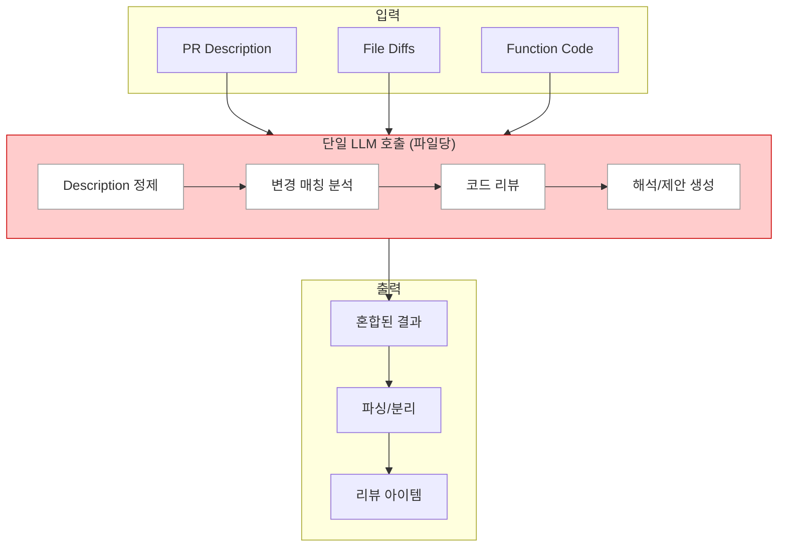
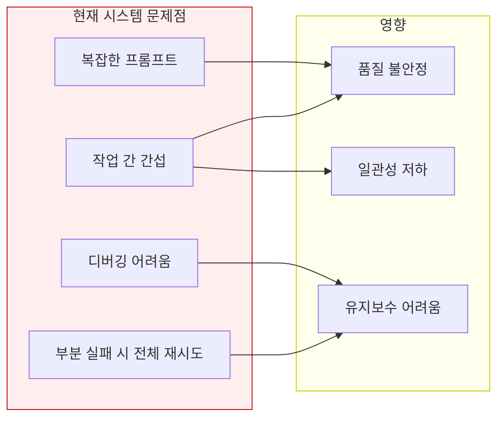
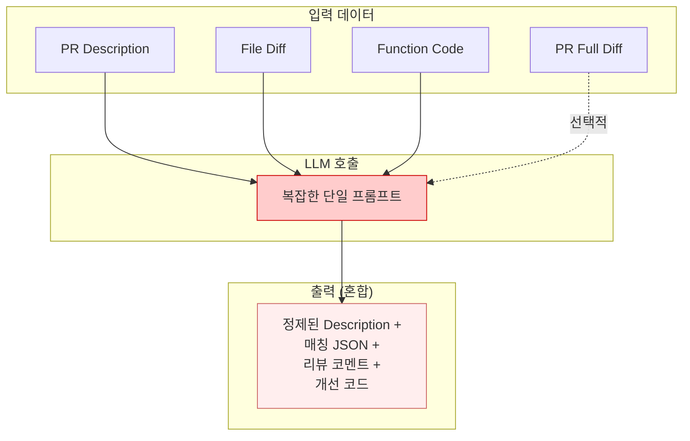

# 현재 시스템 흐름

## 개요

현재 시스템은 LLM 호출 횟수를 최소화하기 위해 파일당 1회 호출에 모든 작업을 수행합니다.

## 시퀀스 다이어그램

```mermaid
sequenceDiagram
    participant RS as Review System
    participant CR as Code Review System
    participant LLM as LLM (QWEN3)

    RS->>CR: PR 정보 전달
    Note over CR: PR Description, Files, Diffs

    loop 각 파일에 대해
        CR->>LLM: 단일 호출 (4가지 역할)
        Note over LLM: 1. Description 정제<br/>2. 변경 매칭<br/>3. 코드 리뷰<br/>4. 해석/제안 생성

        LLM-->>CR: 혼합된 결과
        Note over CR: 파싱 및 분리 필요
    end

    CR->>LLM: 요약 생성
    LLM-->>CR: PR 요약

    CR-->>RS: 리뷰 결과 반환
```

## 플로우차트

```mermaid
flowchart TD
    subgraph Input["입력"]
        A[PR Description]
        B[File Diffs]
        C[Function Code]
    end

    subgraph SingleCall["단일 LLM 호출 (파일당)"]
        D[Description 정제]
        E[변경 매칭 분석]
        F[코드 리뷰]
        G[해석/제안 생성]

        D --> E --> F --> G
    end

    subgraph Output["출력"]
        H[혼합된 결과]
        I[파싱/분리]
        J[리뷰 아이템]
    end

    A --> SingleCall
    B --> SingleCall
    C --> SingleCall
    SingleCall --> H --> I --> J

    style SingleCall fill:#ffcccc,stroke:#cc0000
    style D fill:#fff,stroke:#999
    style E fill:#fff,stroke:#999
    style F fill:#fff,stroke:#999
    style G fill:#fff,stroke:#999
```

## 문제점 시각화

```mermaid
flowchart LR
    subgraph Problems["현재 시스템 문제점"]
        P1[복잡한 프롬프트]
        P2[작업 간 간섭]
        P3[디버깅 어려움]
        P4[부분 실패 시 전체 재시도]
    end

    subgraph Effects["영향"]
        E1[품질 불안정]
        E2[일관성 저하]
        E3[유지보수 어려움]
    end

    P1 --> E1
    P2 --> E1
    P2 --> E2
    P3 --> E3
    P4 --> E3

    style Problems fill:#ffeeee,stroke:#cc0000
    style Effects fill:#ffffee,stroke:#cccc00
```

## 데이터 흐름

```mermaid
flowchart TB
    subgraph Input["입력 데이터"]
        PR[PR Description]
        FD[File Diff]
        FC[Function Code]
        PD[PR Full Diff]
    end

    subgraph LLM["LLM 호출"]
        PROMPT[복잡한 단일 프롬프트]
    end

    subgraph Output["출력 (혼합)"]
        O1["정제된 Description +<br/>매칭 JSON +<br/>리뷰 코멘트 +<br/>개선 코드"]
    end

    PR --> PROMPT
    FD --> PROMPT
    FC --> PROMPT
    PD -.->|선택적| PROMPT
    PROMPT --> O1

    style PROMPT fill:#ffcccc,stroke:#cc0000
    style O1 fill:#ffeeee,stroke:#cc6666
```
