# 개선 시스템 흐름

## 개요

개선된 시스템은 역할별로 분리된 컴포넌트와 파이프라인 구조를 사용합니다.

## 시퀀스 다이어그램

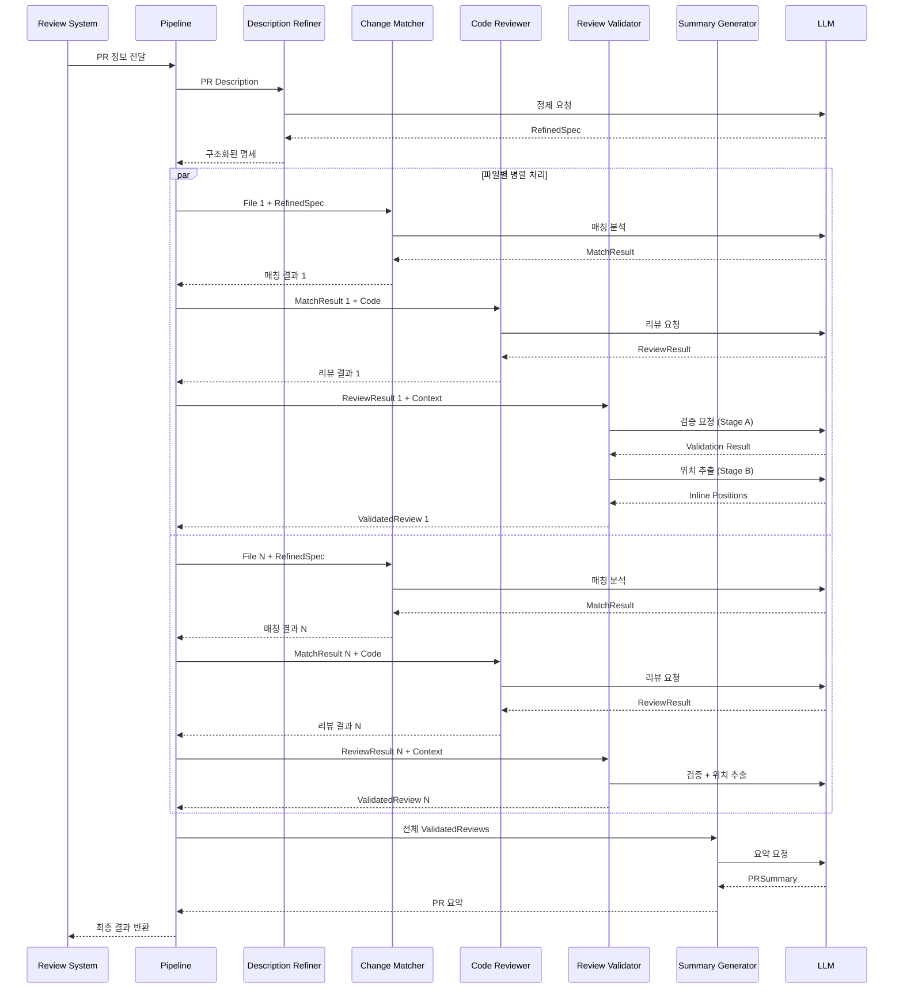

## 파이프라인 아키텍처

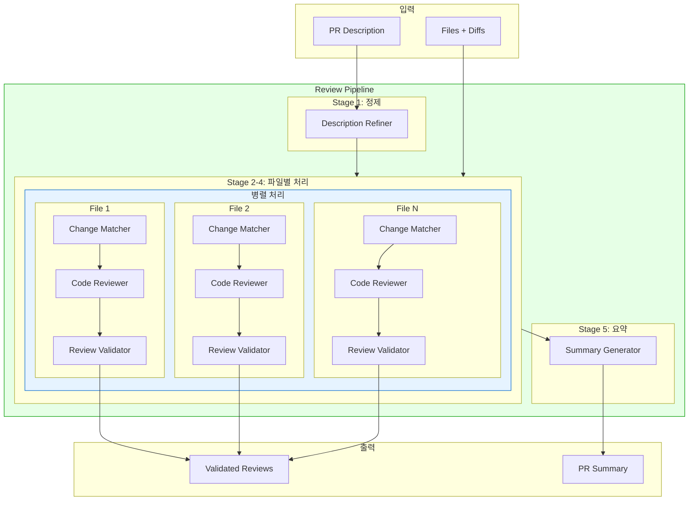

## 컴포넌트 상세

```mermaid
flowchart LR
    subgraph Refiner["Description Refiner"]
        R_IN[PR Description]
        R_PROC[구조 분석 &<br/>항목 추출]
        R_OUT[RefinedSpec]
        R_IN --> R_PROC --> R_OUT
    end

    subgraph Matcher["Change Matcher"]
        M_IN1[RefinedSpec]
        M_IN2[File Diff]
        M_PROC[매칭 분석]
        M_OUT[MatchResult]
        M_IN1 --> M_PROC
        M_IN2 --> M_PROC
        M_PROC --> M_OUT
    end

    subgraph Reviewer["Code Reviewer"]
        RV_IN1[MatchResult]
        RV_IN2[Function Code]
        RV_PROC[COT 분석 &<br/>버그 탐지]
        RV_OUT[ReviewResult]
        RV_IN1 --> RV_PROC
        RV_IN2 --> RV_PROC
        RV_PROC --> RV_OUT
    end

    subgraph Validator["Review Validator"]
        V_IN1[ReviewResult]
        V_IN2[Context]
        V_PROC[검증 &<br/>위치 추출]
        V_OUT[ValidatedReview]
        V_IN1 --> V_PROC
        V_IN2 --> V_PROC
        V_PROC --> V_OUT
    end

    subgraph Summary["Summary Generator"]
        S_IN[ValidatedReviews]
        S_PROC[종합 &<br/>우선순위화]
        S_OUT[PRSummary]
        S_IN --> S_PROC --> S_OUT
    end

    R_OUT --> M_IN1
    M_OUT --> RV_IN1
    RV_OUT --> V_IN1
    V_OUT --> S_IN

    style Refiner fill:#ffe6e6,stroke:#cc6666
    style Matcher fill:#e6e6ff,stroke:#6666cc
    style Reviewer fill:#e6ffe6,stroke:#66cc66
    style Validator fill:#fff0e6,stroke:#cc9966
    style Summary fill:#f0e6ff,stroke:#9966cc
```

## Review Validator 상세 흐름

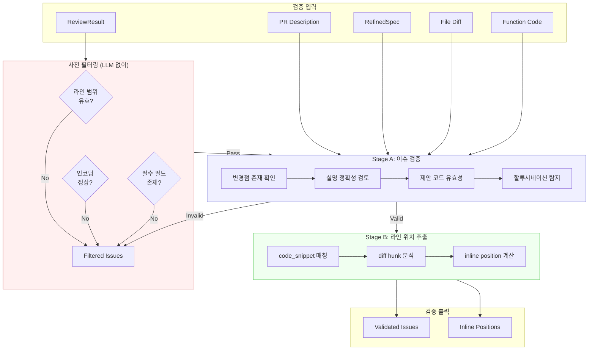

## 검증 체크 상세

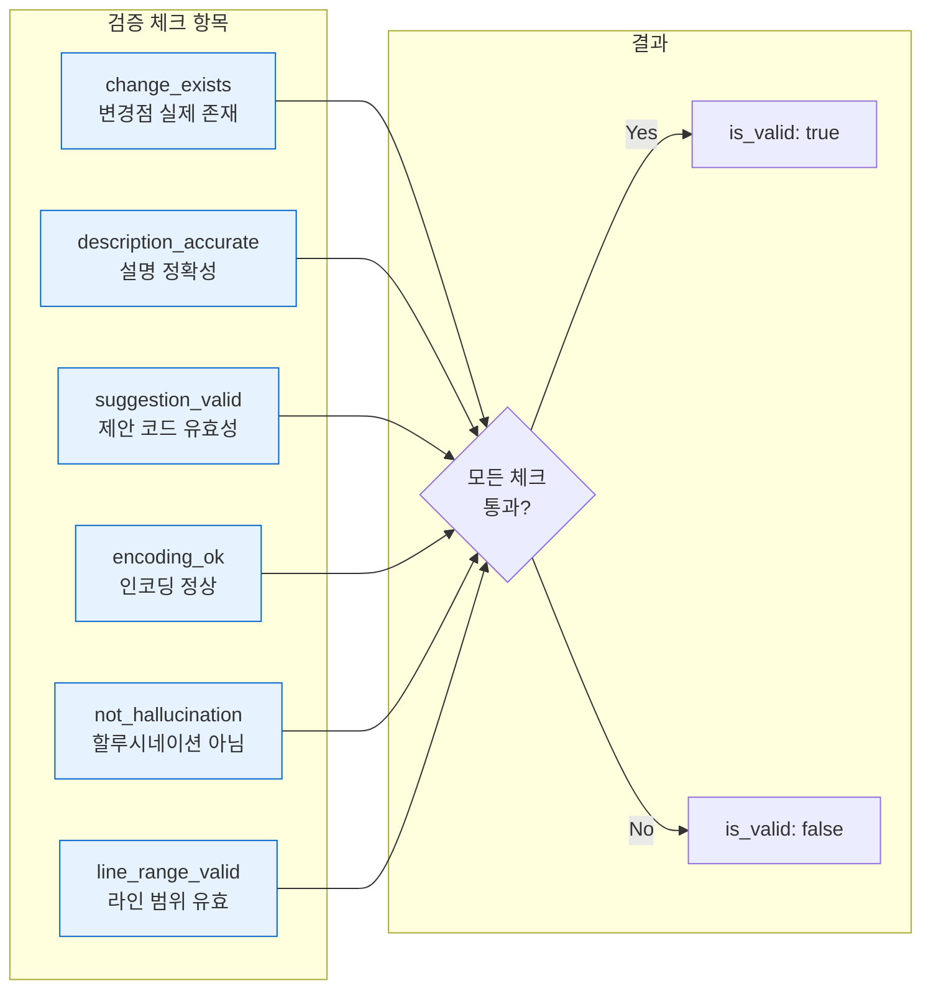

## 데이터 흐름 상세

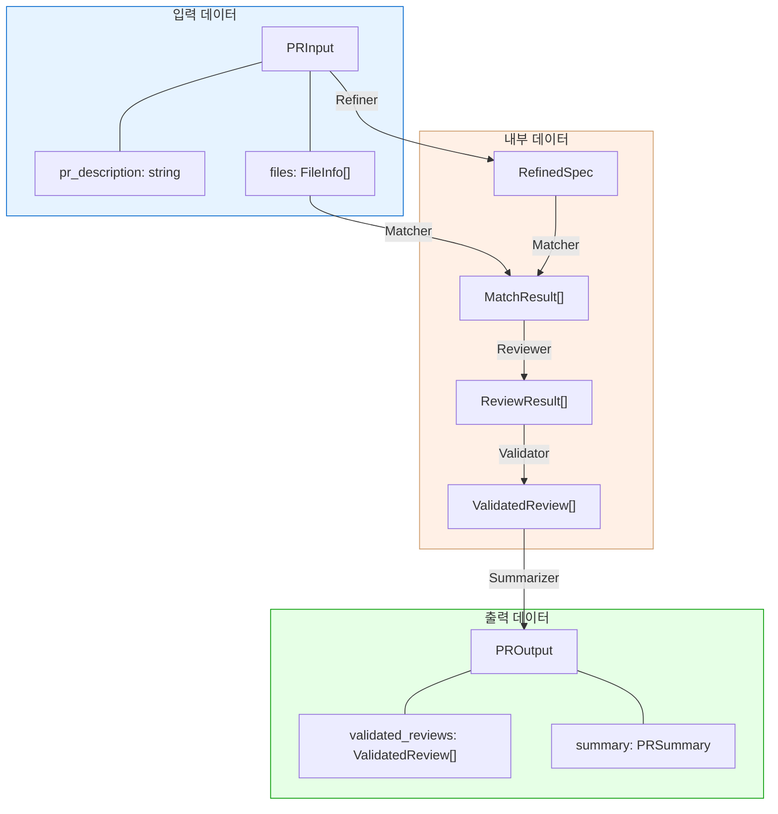

## 호출 최적화

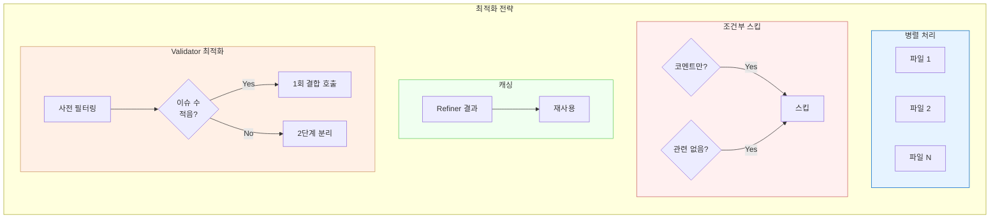

## 현재 vs 개선 비교

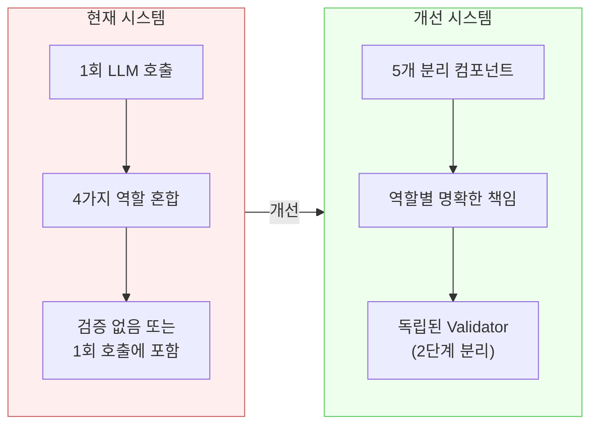

## 듀얼 모델 병렬 처리

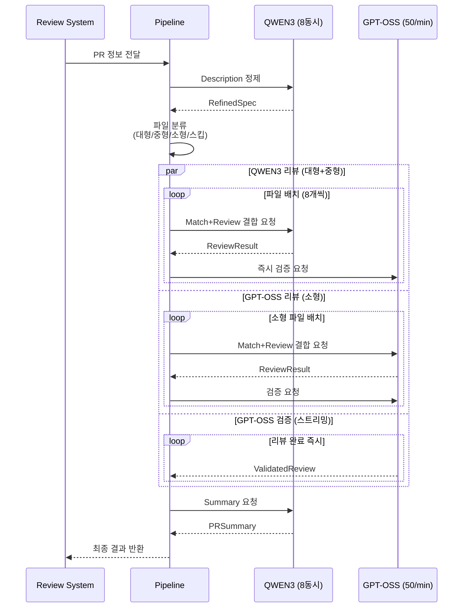

## 듀얼 모델 아키텍처

```mermaid
flowchart TB
    subgraph Input["입력"]
        PR[PR Description]
        FILES[Files + Diffs]
    end

    subgraph Classifier["파일 분류기 (로컬)"]
        CL1{파일 크기?}
        CL2[대형 >100K]
        CL3[중형 10K-100K]
        CL4[소형 <10K]
        CL5[스킵 대상]
    end

    subgraph QWEN["QWEN3 Pool (8 동시)"]
        REF[Description Refiner]
        QR1[Match+Review 1]
        QR2[Match+Review 2]
        QRN[Match+Review N]
        SUM[Summary Generator]
    end

    subgraph GPTOSS["GPT-OSS Pool (50/min)"]
        GR1[Match+Review<br/>(소형 파일)]
        VAL[Review Validator<br/>(스트리밍)]
    end

    subgraph Skip["스킵 처리"]
        SKIP[기본 정보만 생성<br/>(No LLM)]
    end

    subgraph Output["출력"]
        REVIEWS[Validated Reviews]
        SUMMARY[PR Summary]
    end

    PR --> REF
    REF --> Classifier
    FILES --> Classifier

    CL1 --> CL2 --> QR1
    CL1 --> CL2 --> QR2
    CL1 --> CL2 --> QRN
    CL1 --> CL3 --> QR1
    CL1 --> CL3 --> QRN
    CL1 --> CL4 --> GR1
    CL1 --> CL5 --> SKIP

    QR1 --> VAL
    QR2 --> VAL
    QRN --> VAL
    GR1 --> VAL

    VAL --> REVIEWS
    SKIP --> REVIEWS
    REVIEWS --> SUM
    SUM --> SUMMARY

    style QWEN fill:#e6f3ff,stroke:#0066cc
    style GPTOSS fill:#fff0e6,stroke:#cc9966
    style Skip fill:#f0f0f0,stroke:#999999
```

## 스트리밍 파이프라인 상세

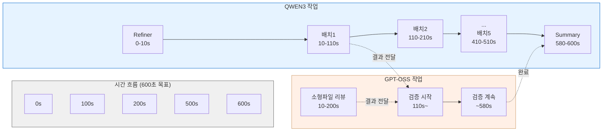

## 성능 최적화 전략

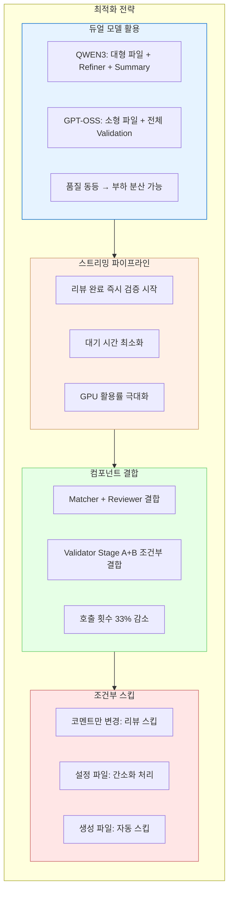
